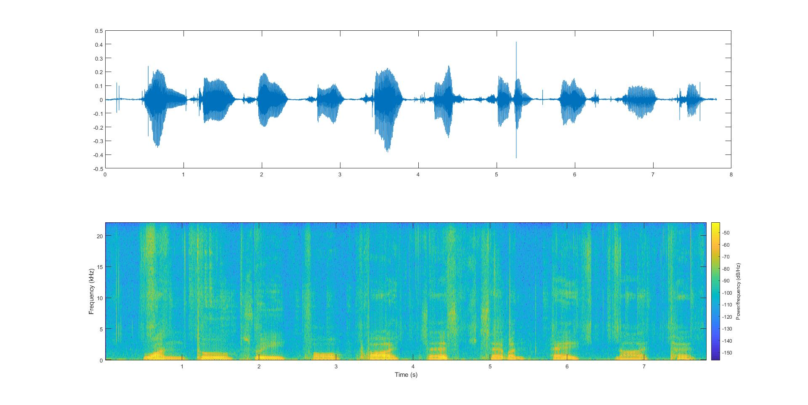
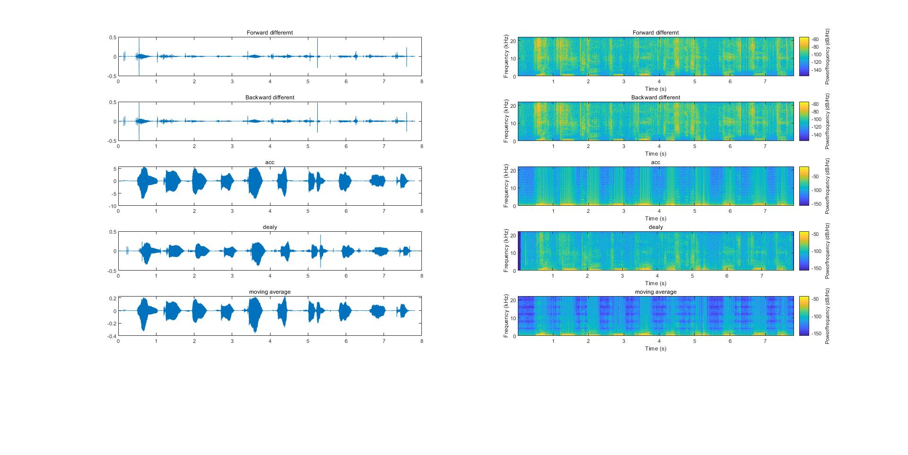
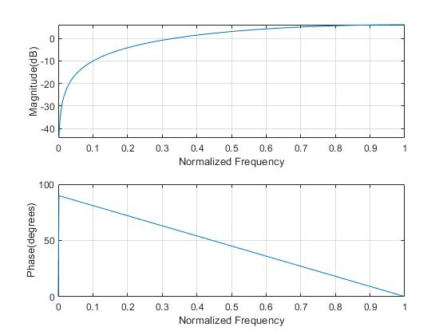
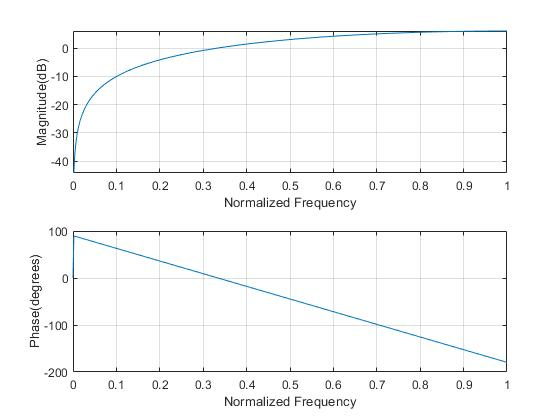
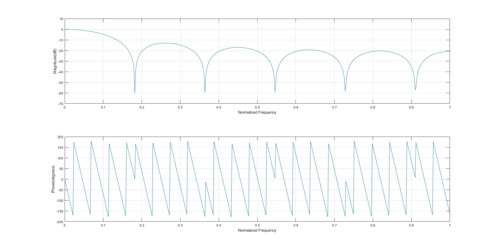
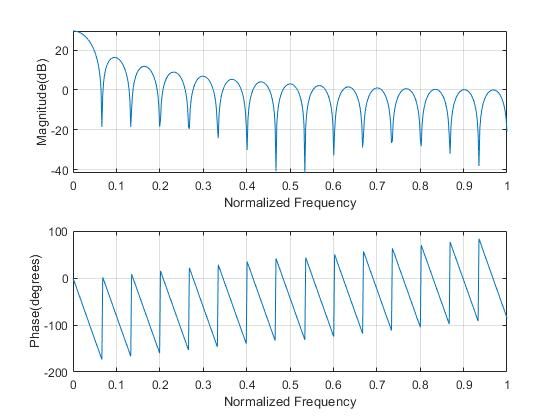
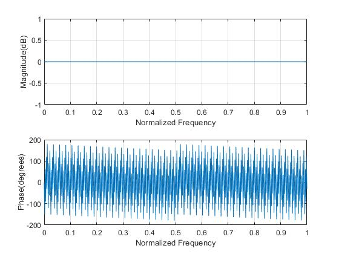

# lab-2-LTI-System-Convolution-and-Frequency-Response-107AE4001

## 原始頻譜圖
 

## Lab2的音頻調頻圖
 

## 頻率響應——Forward_differernt

## 頻率響應——Backward_different

## 頻率響應——moving_average

## 頻率響應——acc

## 頻率響應——delay

## Lab2的主程式碼
clear;

clc;

[s,fs]= audioread('C:\Users\Administrator\Desktop\Lab2\test.wav');%讀取test檔案

time=(1:length(s))/fs;

figure(1);

subplot(2,1,1);

plot(time,s);

subplot(2,1,2);

spectrogram(s,256,250,[],fs,'yaxis');

figure(2);

h1=[1 -1 0];         %Forward differernt   

p1=conv(s,h1);

time2=(1:length(p1))/fs;

subplot(6,2,1);

plot(time2,p1);

subplot(6,2,2);

spectrogram(p1,256,250,[],fs,'yaxis');

audiowrite('C:\Users\Administrator\Desktop\Lab2\Forward_differ.wav',p1,fs);

figure(3);

myfrequ(h1);

h2=[0 1 -1];         %Backward different

p2=conv(s,h2);

time3=(1:length(p2))/fs;

subplot(6,2,3);

plot(time3,p2);

subplot(6,2,4);

spectrogram(p2,256,250,[],fs,'yaxis');

audiowrite('C:\Users\Administrator\Desktop\Lab2\Backward_differ.wav',p2,fs);

figure(4);

myfrequ(h2);

h3=ones(1,30);    %acc

p3=conv(s,h3);

time4=(1:length(p3))/fs;

subplot(6,2,5);

plot(time4,p3);

subplot(6,2,6);

spectrogram(p3,256,250,[],fs,'yaxis');

audiowrite('C:\Users\Administrator\Desktop\Lab2\acc.wav',p3,fs);

figure(5);

myfrequ(h3);

h4=zeros(1,5000);       %dealy

h4(3500)=1;

p4=conv(s,h4);

time5=(1:length(p4))/fs;

subplot(6,2,7);

plot(time5,p4);

subplot(6,2,8);

spectrogram(p4,256,250,[],fs,'yaxis');

audiowrite('C:\Users\Administrator\Desktop\Lab2\delay.wav',p4,fs);

figure(6);

myfrequ(h4);

M1=-40;                 %moving average

M2= 50;

h5=zeros(1,100);

h5(-M1:M2) = 1/(M1+M2+1);

p5=conv(s,h5);

time6=(1:length(p5))/fs;

subplot(6,2,9);

plot(time6,p5);

subplot(6,2,10);

spectrogram(p5,256,250,[],fs,'yaxis');

audiowrite('C:\Users\Administrator\Desktop\Lab2\moving_average',p5,fs);

figure(7);

myfrequ(h5);

## conv的程式碼
function  y=conv(x,h)

y=zeros(1,length(h)+length(x)-1);

  for i=1:length(h)
  
    for j=1:length(x)
    
        y(i+j-1)=h(i)*x(j)+y(i+j-1);
        
    end
    
  end
  
end

## myfrequ的主程式碼
function H =myfrequ(h,x)

if ~exist('x','var')

    x=512;
    
end

H=zeros(1,x);

w=0;

for j=1:x

    for k=0:length(h)-1
    
        if(w==pi/2||w==pi)
        
            e=exp(-1i*sym(w)*k);
            
        else
        
            e=exp(-1i*w*k);
            
        end
        
    H(j)=H(j)+h(k+1)*e;
    
    end
    
 w=j*pi/x;
 
end

q=abs(H);

for m=1:x

    if(abs(q-1)<1e-15)
    
        q(m)=round(q(m));
        
    end
end

x=0:pi/(x-1):pi;

subplot(2,1,1);

plot(x/pi,20*log10(q));

xlabel('Normalized Frequency');

ylabel('Magnitude(dB)');

grid on;

subplot(2,1,2);

plot(x/pi,angle(H)*180/pi);

xlabel('Normalized Frequency');

ylabel('Phase(degrees)');

grid on;

end
